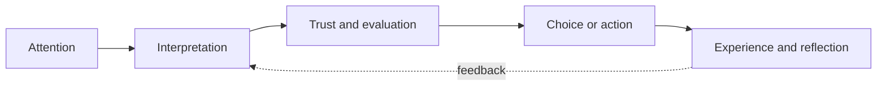

# Chapter 1: Persuasion and Human Decision-Making

Persuasion is the practice of shaping how people notice, interpret, trust, and act on information. It appears in advertising, public health, political speech, product design, classroom teaching, and ordinary conversation. A designer persuades whenever a choice of words, images, layout, color, or sequence makes one interpretation or action feel more likely than another.

Persuasion does not mean controlling a person's mind. People bring their own goals, experiences, identities, and constraints to a decision. Good persuasion gives them a clearer reason to consider an option. It can make a useful choice easier to understand without pretending that the choice is something else.

## Persuasion, Coercion, and Manipulation

These ideas can overlap, but they are not interchangeable:

| Approach | How it works | What happens to the audience's choice |
| --- | --- | --- |
| Persuasion | Offers reasons, evidence, meaning, or an appealing experience | The person can evaluate the message and freely accept or reject it |
| Coercion | Uses force, threats, punishment, or serious pressure | The person is pushed toward compliance because refusing feels unsafe |
| Manipulation | Hides relevant information, exploits a vulnerability, or creates a misleading impression | The person may choose, but the decision is distorted by deception or unfair pressure |

Imagine a plain white T-shirt. The shirt itself has not changed, but its presentation can invite different decisions:

- A product page might frame it as a reliable everyday basic, showing its fabric, fit, and care instructions clearly.
- A campaign might frame it as part of a community uniform, showing many people wearing the same simple shirt.
- A luxury label might frame it as a precisely cut essential, using restrained photography and emphasizing construction.

Each version directs attention and supplies meaning. None is automatically unethical. The ethical question is whether the framing is truthful and whether the audience still has a fair chance to understand what they are being offered.

## A Simple Decision Journey

Persuasion often works across a sequence rather than in one dramatic moment. A designer may first earn attention, then help a person interpret an offer, then reduce uncertainty, and finally make an action possible.

The sequence is not a guarantee. A striking headline can earn attention but lose trust. A trustworthy explanation can still fail if the action is confusing or inaccessible. Persuasion is therefore a design problem involving the whole experience, not just a slogan.

## Cialdini's Principles of Influence

Robert Cialdini's research and writing are widely associated with seven principles of influence. These principles describe common tendencies, not buttons that work on everyone. Context, culture, individual differences, and the quality of the offer still matter.

| Principle | Typical mechanism | Ethical use | Misuse risk |
| --- | --- | --- | --- |
| Reciprocity | People often feel inclined to return a genuine benefit | Give a useful sample, guide, or service before making a clear request | Offering a token to create guilt or an unwanted obligation |
| Commitment and consistency | People tend to value alignment between their actions, statements, and identities | Help someone make a voluntary, informed commitment that supports their real goal | Getting a small agreement and then hiding a much larger demand |
| Social proof | In uncertain situations, people look to what similar others do | Show accurate reviews, participation data, or examples from a relevant audience | Fabricating popularity, using fake reviews, or implying that everyone agrees |
| Liking | Familiarity, similarity, and positive associations can increase openness | Use a respectful voice and represent the intended audience authentically | Using charm, flattery, or manufactured similarity to bypass judgment |
| Authority | Relevant expertise or credible institutions can reduce uncertainty | Identify qualifications and explain why the expertise applies | Borrowing prestige, uniforms, or titles to imply expertise that is absent |
| Scarcity | Limited availability can increase perceived value and urgency | State a real limit, such as a genuine production quantity or deadline | Inventing countdowns, false shortages, or pressure that prevents comparison |
| Unity | A shared identity can create a sense of belonging and mutual connection | Invite people into a real community with shared values and responsibilities | Exploiting identity, nationalism, or group loyalty to silence criticism |

For the white T-shirt, social proof might appear as verified reviews from people who actually bought it. Authority might be a transparent note from a textile specialist about the fabric. Scarcity would be appropriate only if the shirt really is a limited run. The shirt does not become better merely because a countdown clock is placed beside it.

## Two More Useful Concepts

### Framing

The framing effect describes how the wording and context around equivalent information can influence interpretation. Saying that a shirt is “95% cotton” emphasizes one feature; saying it is “5% synthetic fiber” emphasizes another. The underlying composition is the same, but the frame guides attention.

Framing is unavoidable because every design selects some details and leaves others in the background. Ethical framing does not require neutral presentation, which is nearly impossible. It requires that the chosen frame not hide facts that would reasonably change the decision. A designer promoting the T-shirt as durable should provide evidence for durability rather than relying only on an image that looks sturdy.

### Loss Aversion and Defaults

Behavioral economics often uses the idea of loss aversion: in many situations, people react more strongly to losing something than to gaining an equivalent thing. A message such as “Keep your current price” may feel more urgent than “Receive a discount,” even when the financial result is identical.

Defaults also matter. A preselected newsletter checkbox, a suggested donation amount, or a recommended shirt size can shape action because accepting the default takes less effort. Defaults can be helpful when they reflect a reasonable, reversible choice. They become manipulative when they enroll people in unwanted services, make refusal difficult, or conceal important costs.

Rhetoric offers another useful lens: **ethos** concerns credibility, **logos** concerns reasoning and evidence, and **pathos** concerns emotion and values. A responsible T-shirt campaign might combine all three: explain the fabric and price, make the maker's process credible, and connect the shirt to the feeling of being prepared for everyday life. Emotion is not automatically dishonest; it becomes a problem when it replaces facts that the audience needs.

## Ethics Before Effectiveness

An effective message can still be a bad message. Before using a persuasive principle, ask who benefits, who bears the risk, and what the audience cannot easily see. Pay special attention when the audience is young, financially stressed, grieving, isolated, or otherwise vulnerable. A designer has more responsibility than simply asking whether a tactic increases clicks or sales.

### Questions to Ask Before Trying to Persuade

1. What do I want the audience to notice, understand, feel, or do?
2. Is the offer or claim true, specific, and supported by evidence?
3. What important information might my framing leave out?
4. Am I helping people make a choice, or making refusal confusing, costly, or embarrassing?
5. Is the urgency real, and can the audience compare alternatives at a reasonable pace?
6. Who might be especially vulnerable to this message or interface?
7. Would I be comfortable explaining this tactic to the audience in plain language?
8. Does the design respect the audience's goals, privacy, accessibility, and ability to change their mind?

For the white T-shirt, these questions might reveal that a campaign celebrates “simplicity” while hiding an uncomfortable fit, unclear return policy, or environmental claim with no evidence. Persuasion should improve understanding, not merely improve conversion numbers.

## Explore Further

If you want to investigate the ideas in this chapter, search for:

- Robert Cialdini's seven principles of influence and the differences between influence principles and persuasion tactics
- framing effect and decision-making experiments
- loss aversion and default effects in behavioral economics
- ethos, logos, and pathos in rhetorical analysis
- dark patterns and ethical user experience design

Check the author, publication, date, methods, and evidence when evaluating what you find. Search suggestions are a starting point, not proof that every result is reliable.

## What You Should Remember

Persuasion shapes attention, interpretation, trust, and action. It is different from coercion because it leaves room for a meaningful choice, and different from manipulation because it should not depend on deception or unfair pressure. Cialdini's principles, framing, loss aversion, defaults, and rhetoric help designers understand why messages work. The plain white T-shirt reminds us that presentation can change meaning without changing the object, which makes truthful framing and ethical judgment essential.