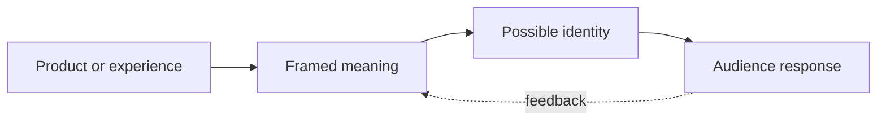

# Chapter 2: Brand Archetypes and Meaning

A plain product rarely arrives in the world with meaning already attached to it. A white T-shirt is fabric, thread, shape, and construction. It can also suggest independence, belonging, care, status, play, or simplicity depending on the story and experience built around it.

Brand archetypes are a practical framework for making those meanings more recognizable. An archetype is a generalized cultural and narrative pattern: a recurring way of imagining a person, group, role, or quest. In branding, archetypes help a team make consistent choices about voice, images, behavior, product experience, and the kind of relationship it wants to create with an audience.

The useful question is not simply, "Which archetype is this brand?" Ask instead:

> What does the audience get to feel, imagine, or become by choosing this brand?

## A Working Set of Archetypes

The following set is a vocabulary, not a scientific diagnostic test. Each archetype names a cluster of expectations that can guide design decisions.

| Archetype | Core promise | Audience may want to feel, imagine, or become |
| --- | --- | --- |
| Explorer | Freedom, discovery, and self-direction | Independent, capable, and ready for somewhere new |
| Sage | Understanding and good judgment | Informed, thoughtful, and able to see clearly |
| Creator | Original expression and making | Imaginative, skillful, and able to bring an idea into form |
| Ruler | Order, standards, and responsibility | In control, respected, and prepared to lead |
| Caregiver | Protection, generosity, and support | Safe, cared for, and able to care for others |
| Rebel | Independence from stale rules | Bold, awake, and free to challenge convention |
| Hero | Effort, courage, and achievement | Strong enough to face a meaningful challenge |
| Everyperson | Belonging, practicality, and solidarity | Welcome, understood, and part of ordinary life |
| Innocent | Hope, simplicity, and goodness | At ease, optimistic, and close to what feels right |
| Jester | Play, humor, and release | Lighter, more spontaneous, and willing to enjoy the moment |
| Lover | Connection, beauty, and appreciation | Desired, expressive, and attentive to pleasure or relationship |
| Magician | Transformation and possibility | Able to see a new future or make change happen |

These categories can overlap. A cooking project might use the Sage to explain technique, the Caregiver to welcome beginners, and the Creator to encourage experimentation. A brand does not need to force every decision into one box. The framework is most useful when it helps a team notice whether its choices are reinforcing or contradicting the intended meaning.

## From Product to Identity

Archetypal branding connects a material object to a story about the person who chooses it. The connection should not be treated as magic. It is built through repeated signals: language, visuals, service, price, materials, community, and the behavior of the organization.

For example, the same white T-shirt can be shown as a dependable daily layer, an object of precise craft, or a sign of resistance to overcomplication. The shirt remains identical in this thought experiment. The meaning changes because the surrounding choices tell the audience what kind of story the object belongs to.

## Three Ways to Position the Same White T-Shirt

### 1. The Explorer T-Shirt

The shirt is presented as a dependable layer for movement. The copy emphasizes packability, comfort, repair, and readiness for changing conditions. Images place it in ordinary moments of travel or outdoor discovery rather than in a polished studio. The audience is invited to imagine becoming more self-directed and prepared.

The archetype does not require claiming that the shirt will create an adventurous life. It gives the shirt a role in a story about choosing the next path.

### 2. The Creator T-Shirt

The same shirt becomes a blank but carefully made canvas. The presentation emphasizes its shape, surface, and relationship to other materials. The audience sees it layered, altered, photographed, or used as the quiet foundation of an outfit. The invitation is to imagine making something personal rather than merely consuming a finished look.

Here, the shirt's plainness is not a lack of personality. It is framed as room for expression.

### 3. The Rebel T-Shirt

The shirt is positioned as a refusal of needless complexity. The message questions trend cycles, excessive branding, or the pressure to perform status through clothing. The design might use direct language and an intentionally unpolished attitude. The audience gets to feel independent by choosing the simplest possible uniform.

This position can be dramatically different from the Explorer or Creator versions even though the garment is unchanged. It is also easy to make the Rebel version dishonest: a campaign that criticizes excess while hiding expensive packaging or poor labor practices is performing rebellion rather than practicing it.

### Other Possible Frames

The Caregiver version could emphasize softness, reliable sizing, and clothing that makes daily routines easier. The Ruler version could emphasize exact fit, standards, and controlled presentation. The Everyperson version could show many kinds of people wearing the shirt in familiar settings. The Magician version could present the shirt as the small change that helps someone shift into a new role. Each frame answers the audience's identity question differently.

## Archetypes Are Not Destiny

Archetypes are models, not literal personality types. They do not prove what a person is, predict what every customer will do, or reveal an organization's permanent essence. People contain multiple tendencies, and those tendencies change with situation and time. Someone can want adventure on Saturday, reassurance on Sunday, and expert advice on Monday.

Cultural context matters too. A symbol of authority in one community may feel intimidating in another. Humor, modesty, independence, beauty, family, and rebellion do not carry exactly the same meaning everywhere. A brand team should test its assumptions with the particular people it hopes to serve rather than treating a universal archetype chart as a universal truth.

Archetypes also should not be used to stereotype an audience. Saying that a group is "the Hero audience" can flatten real people into a marketing label. A better use is to ask what aspirations, tensions, and forms of belonging the experience can support. The audience remains more complex than the story a brand tells.

## Choosing and Combining Archetypes

Start with the experience you can actually provide. If a company wants to sound like a Sage but gives vague answers and hides limitations, the archetype is only decoration. If a shirt is positioned as a Caregiver product, its sizing information, returns, fabric feel, and customer support should make that promise believable.

A primary archetype can establish a recognizable center, while a secondary archetype adds dimension. For instance, an Everyperson clothing line might use the Creator to make its designs feel individual without abandoning accessibility. The combination should clarify the experience, not create a pile of unrelated moods.

### Questions to Ask When Choosing an Archetype

1. What should the audience get to feel, imagine, or become through this choice?
2. What real need, desire, or tension does the archetype help us address?
3. Which parts of the product or experience make this meaning credible?
4. What words, images, materials, behaviors, and interactions would reinforce the archetype?
5. Which archetype is primary, and what useful role does a secondary archetype play?
6. Could this framing stereotype, exclude, or pressure the people we hope to reach?
7. How might the meaning change across cultures, communities, or situations?
8. What evidence would show that the audience experiences the intended meaning rather than merely seeing our preferred label?
9. Does the plain white T-shirt still tell the truth about its quality, price, fit, and origin?

These questions move archetypes from mood boards into responsible design practice. They ask the team to connect a story to observable behavior.

## What You Should Remember

Brand archetypes are flexible cultural and narrative patterns that help products and organizations become recognizable as something more than their physical features. They work by connecting a product to meaning, possible identity, and audience experience. The same white T-shirt can become an Explorer's reliable layer, a Creator's open canvas, or a Rebel's simple uniform without changing its material form. Use archetypes as questions and design lenses, not as rigid personality labels or excuses for stereotypes.