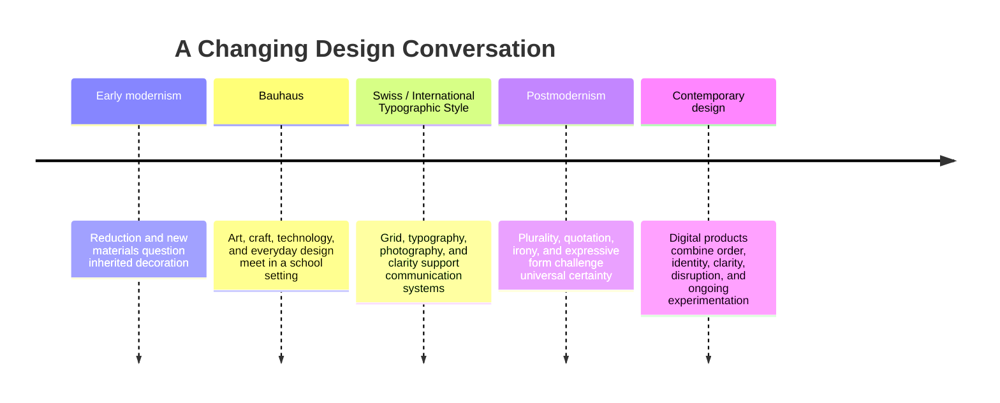

# Chapter 3: Design Language and Visual Ideas

Visual design does more than make information attractive. It tells us what to notice, how to organize what we see, and what kind of world a message seems to belong to. A strict grid can suggest order and competence. A crowded composition can suggest energy, urgency, or abundance. A typeface can feel official, intimate, technical, playful, or historical before we have read every word.

These effects are not automatic laws. Meaning depends on context, culture, familiarity, and use. Still, design traditions give us shared patterns for reading visual choices. Learning those patterns helps us see that a layout is never just a container for content. It is part of the argument.

## A Short History of Modernist Design

Early modernism developed in the context of industrialization, new technologies, mass communication, and social change. Many designers began questioning decorative traditions that seemed disconnected from modern life. They explored reduction, geometric form, new materials, photography, and typography that could communicate efficiently across a growing public sphere.

This was not one single style or one unified movement. It was a broad set of experiments. A recurring belief was that design could be more useful and honest when its structure, materials, and purpose were made clear rather than covered by unnecessary ornament.

### Bauhaus

The Bauhaus school, founded in Germany in 1919, brought together art, craft, architecture, and design education. Its teaching treated making as a way to connect creative thought with materials, tools, industry, and everyday life. The school changed over time and included different teachers and approaches, so it should not be reduced to a single visual recipe.

Its legacy is often associated with geometric forms, functional thinking, experimentation with materials, and the idea that design education should involve both conceptual and practical work. A Bauhaus-related lesson for a student today is that visual language grows from a process and a set of values, not from decorative shapes alone.

### Swiss / International Typographic Style

In the mid-twentieth century, the Swiss or International Typographic Style developed a strong commitment to typographic clarity, asymmetric composition, photography, sans-serif type, and the grid. The grid gave designers a repeatable structure for aligning information. It could support consistency across posters, books, signs, and other communication systems.

The style often aimed for communication that felt objective and widely understandable. That ambition created powerful tools for hierarchy and navigation, but it also raised a question: can any visual language really be universal, or does every system reflect the culture and priorities of the people who made it?

## Postmodernism and the Challenge to Certainty

Postmodern design is not simply "messy modernism." In many contexts, it reacted against the idea that restraint, order, function, and universal rules could solve every communication problem. Designers questioned who gets to define clarity, whose identity disappears when a system claims neutrality, and whether historical styles can be reused, quoted, or mixed rather than left behind.

Postmodern approaches may use expressive typography, visible contradiction, quotation, irony, layering, ornament, vernacular references, and disrupted grids. The goal is not always confusion. A disruption can call attention to a neglected voice, expose the constructed nature of a message, or make room for humor and ambiguity.

Postmodernism also has risks. Irony can become exclusionary when viewers need specialized cultural knowledge to understand the joke. Abundance can overwhelm. A deliberately difficult layout may be interesting to its maker but frustrating to someone trying to complete a task. The point is not that postmodern design is better; it is that it makes different claims about authority, identity, and expression.

## The Tensions Are Still Here

Contemporary web and product design keeps revisiting these arguments. A banking app may use a clear grid, restrained color, and predictable controls because people need confidence and low-friction navigation. A fashion site may break the grid, layer images, and use unusual type because it wants to communicate identity and cultural energy. A product can even combine both: a dramatic landing page followed by a highly ordered checkout process.

| Design tension | One side may emphasize | The other side may emphasize | Contemporary question |
| --- | --- | --- | --- |
| Order and disruption | Stability, sequence, and control | Surprise, critique, and attention | Where should the interface feel predictable, and where can surprise help? |
| Universality and identity | Shared rules and broad access | Specific histories, communities, and voices | Who is represented by the system, and who is made invisible? |
| Clarity and expression | Fast comprehension and low effort | Mood, personality, and interpretation | What must be immediately understood, and what can remain open-ended? |
| Grid and anti-grid | Alignment, rhythm, and consistency | Tension, movement, and emphasis | Is breaking the grid purposeful or merely careless? |
| Restraint and abundance | Focus, economy, and calm | Richness, plurality, and sensory energy | Does the amount of material support the audience or exhaust it? |
| Function and irony | Direct use and dependable meaning | Commentary, humor, and self-awareness | Does the joke deepen the message or get in the user's way? |

The strongest choice depends on the situation. A public-service form and an album cover have different jobs. Even within one product, a designer may use expressive imagery to establish identity and restrained controls to support action. Visual language is a set of decisions, not a loyalty oath to one historical movement.

## Reading the Plain White T-Shirt

The exact same white T-shirt can feel like a different product because presentation changes the visual argument.

A modernist presentation might show the shirt in a clean, evenly lit photograph with precise measurements, restrained typography, a clear grid, and minimal decoration. The product page would emphasize construction, fit, material, and efficient comparison. The shirt may feel rational, durable, universal, and easy to evaluate.

A postmodern presentation might crop the shirt unexpectedly, combine it with contrasting type, quote familiar clothing imagery, layer multiple references, or place the garment in an intentionally awkward composition. The page might draw attention to fashion codes and the idea that a "basic" garment is never culturally neutral. The same shirt may feel ironic, expressive, contested, or connected to a particular identity.

Neither presentation changes the shirt. Each creates a different path through attention and interpretation. The ethical requirement remains the same: visual personality should not hide essential information about the product.

## How to Read a Design

When you encounter a poster, package, website, garment, or interface, move from description to interpretation:

1. **Describe the evidence.** What do you actually see: type size, alignment, color, image scale, spacing, material, movement, or repetition?
2. **Find the structure.** Is there a grid, hierarchy, sequence, symmetry, pattern, or deliberate break?
3. **Notice the voice.** Does the design feel neutral, intimate, authoritative, playful, urgent, luxurious, local, or strange?
4. **Ask what is included.** Which people, histories, bodies, or cultural references are visible?
5. **Ask what is absent.** What information or perspective has been pushed out of the frame?
6. **Identify the expected action.** Should you read, buy, navigate, share, pause, question, or participate?
7. **Test the tension.** Is the design balancing clarity with expression, or is one goal overpowering the other?
8. **Consider the situation.** Who is the audience, what do they already know, and what constraints are they working under?

This method prevents a quick label such as "modern" or "postmodern" from replacing actual analysis. The label is a starting hypothesis. The visual evidence is what you need to examine.

## Museum Research

Historical examples are most useful when you inspect the actual object record rather than relying on an unsourced image or a simplified style list. Search the online collections or study resources of institutions such as The Metropolitan Museum of Art, MoMA, Cooper Hewitt, the V&A, Bauhaus archives, or another credible museum, library, university, or design archive.

Try search terms such as:

- early modernist graphic design poster collection
- Bauhaus typography object collection
- Bauhaus textile or product design archive
- Swiss International Typographic Style poster grid
- modernist book design typography museum collection
- postmodern graphic design expressive typography archive
- postmodern architecture quotation irony design collection

Verify each object yourself. Record the institution, object title, maker, date, materials or medium, and collection record before using it as an example. Check that the object actually exists in the collection and that your description matches the institution's information. Do not treat a search-result snippet, social-media post, or unattributed image as evidence.

When comparing objects, ask what changed across time and what did not. Look at the grid, type, image treatment, material, intended audience, and historical situation. The goal is not to place every object into a perfect category. It is to build an evidence-based vocabulary for explaining how visual choices carry ideas.

## What You Should Remember

Modernist design traditions developed tools for structure, function, clarity, and reduction, with Bauhaus and the Swiss / International Typographic Style offering important examples. Postmodern design challenged claims of universal order through plurality, identity, quotation, irony, disruption, and expressive form. Contemporary design continues to move between these positions. A grid, an anti-grid, a quiet layout, or an abundant one can each communicate values, so read the visual decisions as part of the message.