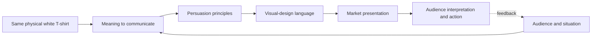

# Chapter 4: One Shirt, Four Stories

Here is the challenge: imagine one ordinary, high-quality plain white T-shirt. The cut, fabric, stitching, and care instructions stay substantially the same in every version. We are allowed to change the name of the campaign, the images, the page layout, the voice, and the story around it.

That constraint is useful because it makes the design work visible. If four presentations feel like four different products, the difference is not hiding in the shirt. It is being created through audience, meaning, persuasion, and visual language.

The question for every concept is:

> What is the customer actually being invited to buy beyond the fabric?

The honest answer might be readiness, judgment, defiance, or belonging. Those meanings can be valuable, but they are not the same as a new fiber or a better seam. Keeping that distinction clear is the designer's job.

## The Combination at Work

The ingredients influence one another. An Explorer story aimed at commuters may need different evidence and imagery from an Explorer story aimed at hikers. A postmodern visual language may attract attention, but it still needs a clear path to product information and purchase. There is no universal “best” presentation outside a particular audience and purpose.

## Concept One: The Open Road

**Audience:** Students, commuters, and travelers who want dependable clothing that fits an active, changing day.

**Chosen brand archetype:** Explorer.

**Persuasion principles:** Social proof through accurate customer use cases; authority through clear information about fit, care, and construction; commitment and consistency by framing the shirt as a repeatable part of a flexible wardrobe.

**Visual-design language:** Functional, spacious, and documentary. Use practical maps, movement, natural light, and a layout that lets the shirt's details remain easy to inspect. The design should feel ready to leave the house, not like an adventure fantasy detached from ordinary life.

**Headline:** “Go Light. Go Further.”

**Short product story:** This is the shirt you reach for when the day has not decided what it will become. It works under a jacket, on its own, or in a bag between destinations. The story is about preparedness and self-direction, not about pretending that a garment guarantees an adventurous life.

**Imagery direction:** Show the same shirt in a sequence of believable transitions: folded into a bag, worn on a train, layered for an evening, and washed for the next day. Include close views of the actual fabric and fit alongside the wider scenes.

**Meaning the customer is invited to buy:** Readiness, freedom from overpacking, and the identity of someone able to choose the next direction.

**Ethical concern or possible misuse:** The campaign could romanticize travel, mobility, or outdoor access while ignoring their cost and unequal availability. It could also imply performance or durability that the shirt has not been tested to provide. Claims should stay within evidence, and the audience should not be pressured to buy a lifestyle as a substitute for product information.

## Concept Two: The Measured Essential

**Audience:** People who value calm interfaces, careful comparison, and a small wardrobe of dependable items.

**Chosen brand archetype:** Sage, with a secondary Ruler tendency.

**Persuasion principles:** Authority through transparent specifications; consistency through a repeatable wardrobe system; framing by presenting simplicity as deliberate rather than unfinished.

**Visual-design language:** Restrained modernist and Swiss-influenced. Use an asymmetric grid, disciplined hierarchy, neutral space, precise measurements, limited color, and photography that makes construction legible. Nothing should compete with the information needed to evaluate the shirt.

**Headline:** “The Essential, Examined.”

**Short product story:** The shirt is presented as a decision made carefully once and used often. A quiet page shows the silhouette, fabric description, size chart, care instructions, price, and return policy in a consistent structure. The drama comes from the confidence that no drama is required.

**Imagery direction:** Use front, back, detail, and scale views with consistent lighting. Show the shirt on more than one body or provide measurements so “universal” does not quietly mean “designed for one body.”

**Meaning the customer is invited to buy:** Judgment, control, and relief from needless choice.

**Ethical concern or possible misuse:** A clean grid can make weak claims look authoritative. Words such as “precise,” “responsible,” or “built to last” need evidence. The visual language should not pretend that a design is culturally neutral or that one standard fit serves everyone. Clarity is a responsibility, not a costume.

## Concept Three: The Basic Is a Protest

**Audience:** People tired of trend pressure and interested in clothing that questions status signals and overconsumption.

**Chosen brand archetype:** Rebel.

**Persuasion principles:** Contrast by challenging the category's usual expectations; unity by inviting people into a shared refusal of unnecessary branding; scarcity only if a real production limit exists, never as invented urgency.

**Visual-design language:** Disruptive and postmodern. Use abrupt crops, clashing type scales, pasted-looking layers, quotation marks, and deliberate tension between an ordinary garment and an overdramatic fashion voice. The page can be funny and self-aware, but product details must remain findable.

**Headline:** “Nothing to Prove.”

**Short product story:** The shirt refuses to perform importance. It is not covered in a logo, a trend forecast, or a promise that wearing it will make the customer morally superior. The campaign makes the familiar basic strange again by asking why a white shirt needs to announce anything at all.

**Imagery direction:** Photograph the shirt in plain settings, then interrupt the images with oversized notes, crossed-out status language, and fragments of competing fashion instructions. Let the layout question its own sales pitch.

**Meaning the customer is invited to buy:** Independence from the pressure to signal taste through constant novelty.

**Ethical concern or possible misuse:** Rebellion is easy to sell and hard to prove. A campaign can criticize consumer culture while encouraging another purchase, or mock branding while quietly building a powerful brand identity. The presentation should disclose what the shirt costs, how it is made, and what “less” actually means instead of using irony to block criticism.

## Concept Four: The Shirt That Shows Up

**Audience:** People who want comfortable, approachable clothing for work, school, family life, and ordinary social situations.

**Chosen brand archetype:** Everyperson, with a secondary Caregiver tendency.

**Persuasion principles:** Liking through familiar, respectful scenes; social proof through varied and accurate customer experiences; reciprocity through genuinely useful fit guidance and easy care information.

**Visual-design language:** Warm, direct, and human-scale. Use natural photographs, conversational copy, accessible contrast, and a flexible layout that gives different people room rather than making one model stand in for everyone.

**Headline:** “A Good Shirt for Real Days.”

**Short product story:** The shirt is not waiting for a perfect occasion. It is there for the presentation, grocery run, studio session, late shift, birthday, or quiet day at home. The story treats reliability as meaningful and ordinary life as worthy of attention.

**Imagery direction:** Show several people wearing the same shirt in varied daily settings. Include signs of real use without turning anyone's life into a staged “relatable” prop. Pair lifestyle images with honest information about fit, fabric, care, and returns.

**Meaning the customer is invited to buy:** Belonging, ease, and the feeling that useful design can support an actual life rather than an idealized one.

**Ethical concern or possible misuse:** “For everyone” can become a vague claim that hides missing sizes, inaccessible service, or imagery that performs diversity without changing the product experience. The campaign should measure its welcome against real availability and listen to people who are left out.

## Synthesis Table

| Concept | Audience | Archetype | Persuasion emphasis | Visual language | Meaning invited |
| --- | --- | --- | --- | --- | --- |
| The Open Road | Active students, commuters, travelers | Explorer | Social proof, authority, commitment | Functional documentary | Readiness and self-direction |
| The Measured Essential | Careful, comparison-minded shoppers | Sage / Ruler | Authority, consistency, framing | Restrained modernist / Swiss-influenced | Judgment and control |
| The Basic Is a Protest | Trend-resistant, anti-status shoppers | Rebel | Contrast, unity, truthful scarcity | Disruptive postmodern | Independence from pressure |
| The Shirt That Shows Up | Everyday shoppers seeking ease and welcome | Everyperson / Caregiver | Liking, social proof, reciprocity | Warm, direct, human-scale | Belonging and reliability |

Notice what the table does not say: it does not claim that one concept changes the shirt's physical quality. It maps how the same evidence can be organized into different invitations. A customer may reject all four stories, combine them, or bring a meaning the campaign did not anticipate.

## A Designer's Reality Check

Before launching any version, compare the story with the actual experience:

1. Which claims describe the shirt, and which describe the identity or feeling around it?
2. Can the product details support the meaning being promised?
3. What information would a skeptical customer need before deciding?
4. Does the imagery represent the audience without turning people into symbols?
5. Is the design language helping people navigate, or merely making the campaign look distinctive?
6. What would count as evidence that the presentation is working beyond clicks or sales?
7. Who might feel excluded, stereotyped, or pressured by this story?

The most persuasive case study is not the one with the loudest headline. It is the one that makes a clear promise, gives the audience enough information to judge that promise, and delivers an experience that earns the meaning it invited people to buy.

## What You Should Remember

One ordinary white T-shirt can be presented as an Explorer's reliable companion, a Sage's measured essential, a Rebel's protest against excess, or an Everyperson's dependable daily uniform. Archetype, persuasion, audience, and visual language work together to make those meanings recognizable. The shirt remains substantially the same, so the designer must distinguish the physical product from the identity and feeling being sold. A strong presentation is imaginative, specific, and honest about that difference.