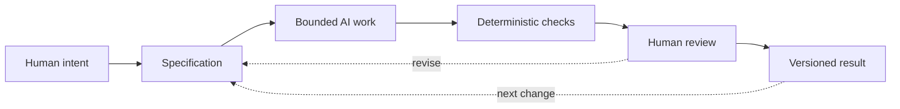

# Chapter 5: From Creative Intent to Reliable Work

The first four chapters followed a white T-shirt through several changes of meaning. The physical shirt stayed nearly the same, but its audience, story, persuasive choices, and visual language changed. That exercise gives us a useful framework for more than branding. It also helps us direct AI-assisted creative and technical work.

AI can generate drafts quickly, but speed does not answer the most important questions. A person still has to decide what the work is for, what it should mean, what constraints matter, and what counts as acceptable. The three lenses from this guide make those decisions easier to name:

- **Persuasion:** What response are we trying to enable?
- **Archetype:** What meaning or identity are we expressing?
- **Design language:** How should that meaning look and feel?

Together, they form a high-level control framework. They help a designer move from a vague wish such as “make this compelling” to a set of choices that can be explained, tested, and revised.

## The Three-Lens Framework

Suppose a team asks an AI assistant to create a product page for the white T-shirt. “Make it exciting” is not enough direction. A more useful brief might say:

- The response we want is careful consideration rather than an impulse purchase.
- The meaning is a Sage-like promise of informed, confident choice.
- The visual language is restrained, grid-based, and easy to inspect.
- The page must include accurate fit, care, price, and return information.

That brief does not dictate every sentence or image. It gives the AI a bounded creative problem and gives the human a way to judge whether the result belongs to the intended project.

The same method works for a technical task. Persuasion might mean helping a user understand a warning and choose the safer action. Archetype might define the product's voice as calm Caregiver rather than playful Jester. Design language might require a quiet hierarchy, accessible contrast, and predictable controls. These are not decoration added after implementation. They shape the experience from the beginning.

## Why Specifications Matter

An AI task should be bounded by a specification: a clear statement of the goal, required outputs, constraints, audience, and checks. A specification narrows the problem enough that the result can be evaluated.

Without a specification, an AI system may produce something fluent but misaligned. It may invent a feature, omit a requirement, choose the wrong tone, or solve a nearby problem that was never requested. A bounded task also makes revision cheaper. When the result misses the goal, the team can identify which requirement was unclear instead of arguing vaguely about whether the draft “feels right.”

A useful specification can include:

1. **Purpose:** What is this work meant to accomplish?
2. **Audience:** Who will use, read, or experience it?
3. **Boundaries:** What files, features, sources, or claims are in scope?
4. **Requirements:** What must be included or avoided?
5. **Acceptance checks:** How will we tell whether the result is complete and correct?
6. **Human decisions:** Which judgments must remain with the person directing the work?

The issue prompts that created this book are small specifications. Each one names a file, describes required content, and gives acceptance criteria. That boundedness is part of why the work can be reviewed.

## What Git Adds

Git provides traceability and recovery. It records changes as a sequence of versions, so a team can inspect what changed, compare a draft with an earlier state, and return to a known version when an experiment goes badly. Branches can isolate a task, and commit messages can explain why a change was made.

This matters especially when AI is generating work. A fast draft can contain a subtle error, an unwanted rewrite, or an accidental deletion. Version control does not decide whether the draft is good, but it makes the decision reversible and the history inspectable. The student or team remains responsible for reviewing the diff before committing and for deciding which version deserves to continue.

## Three Kinds of Checking

Different checks answer different questions.

### Deterministic checks

Automated checks are useful when the question has a repeatable answer. A script can check whether a required file exists, whether Markdown has obvious structural problems, whether a test passes, or whether a build completes. These checks are cheap to run often and good at catching omissions and mechanical errors.

They are not a complete measure of quality. A chapter can have all its headings and still be confusing. A page can pass a build and still exclude its audience. Deterministic checks are a floor of dependable evidence, not a substitute for judgment.

### AI review

AI can review text, code, structure, or consistency and point out possible problems. It can be useful as a second reader, especially for repetitive comparisons or a first pass through a large change. But its review is probabilistic. It can miss an error, misunderstand context, accept a false claim, or sound confident while being wrong.

Treat AI review as evidence to investigate, not as an authority that closes the investigation. Ask for specific checks, inspect important claims, and compare the review with the actual files and behavior.

### Human review

Humans remain responsible for judgment, meaning, truthfulness, context, and final decisions. Only a person with responsibility for the work can decide whether a message is appropriate for its audience, whether an identity claim is respectful, whether a product promise is supported, or whether a technical change creates an unacceptable risk.

## The Pit-Stop Moment

Think of automation as a race car that can keep running around the track. Automated tests and formatting checks can run repeatedly at speed. AI can also keep producing drafts and suggestions. But a race is not won by refusing every pit stop. At selected moments, the car needs to come in so a team can inspect it deliberately, change what matters, and send it back out with a known plan.

Human review is that pit stop. The team should choose review moments based on risk and importance: before publishing, after a major generated change, when a claim affects trust, when a user could be harmed, or when the work changes meaning rather than merely formatting. The goal is not to inspect every keystroke. It is to make the consequential inspections deliberate.

The workflow is not a one-way conveyor belt. Human review can reveal that the specification was incomplete, and a versioned result gives the team a recoverable point from which to try again. The important thing is that each stage has a distinct job.

## A Practical Control Sheet

Before asking AI to create something, write a short control sheet:

| Lens or control | Question | Example for the white T-shirt |
| --- | --- | --- |
| Persuasion | What response are we trying to enable? | Careful evaluation of fit and quality |
| Archetype | What meaning or identity are we expressing? | Informed, self-directed judgment |
| Design language | How should the meaning look and feel? | Restrained grid, clear hierarchy, precise images |
| Specification | What is in scope and what must be true? | One product page with verified product details |
| Deterministic check | What can be checked mechanically? | Required sections, links, tests, or build status |
| Human review | What requires context and judgment? | Whether the promise is honest and the experience is respectful |
| Version control | How can we trace and recover the work? | A focused branch and reviewable commit |

The sheet is intentionally modest. Its purpose is to keep intent visible while the work becomes more detailed.

## Questions for Next Week

1. Which part of your next project is an intentional choice, and which part is merely an inherited default?
2. What response do you want your audience or user to have, and how will you know whether that response is useful rather than merely profitable?
3. What archetypal meaning does the work express, and who might interpret that meaning differently?
4. Which visual choices carry the argument before anyone reads the explanatory text?
5. What should be placed in the specification before AI begins generating?
6. Which requirements can be checked deterministically, and which require human judgment?
7. Where is the next pit stop: the moment when a person must inspect the work carefully before it proceeds?

## What You Should Remember

Persuasion identifies the response a project hopes to enable, archetype identifies the meaning or identity it expresses, and design language determines how that meaning looks and feels. A specification gives AI-assisted work a bounded problem. Deterministic checks provide cheap, repeatable evidence; AI review offers useful but probabilistic assistance; Git provides traceability and recovery. Humans remain responsible for judgment, meaning, truthfulness, context, and final decisions. Good creative and technical work keeps automation moving while making the important human pit stops deliberate.